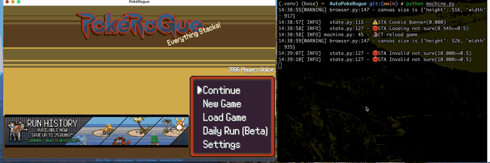

# AutoPokeRogue

使用 OCR 和模拟键盘输入，根据 [Daily Run Guide](https://www.reddit.com/r/pokerogue/?f=flair_name%3A%22Daily%20Run%20Guide%22) 自动完成 [PokeRogue](https://pokerogue.net) 的每日挑战



```
⚠ 注意 ⚠
1. 项目需在前台运行
2. 仍在开发测试中，由于对指令识别可能存在错误，不能确保能100%正确执行
```

## Get Started

### Prerequisites

- Chrome
- Python
- pip

### Setup

1. Code
   1. 安装依赖 ```pip install -r requirements.txt```
   2. 创建配置文件(`config.json`) ```python config.py```
2. Cookie（请保管好自己的 cookie）
   1. 在 Chrome 中登录 pokerogue
   2. 查看 Cookie （[教程](https://developer.chrome.com/docs/devtools/application/cookies?hl=zh-cn#open)）
   3. 将 `pokerogue_sessionId` 字段的值填入 `config.json` 中的 `COOKIE`
3. Chrome Driver
   1. 更新 Chrome
   2. 根据电脑平台下载 [chromedriver](https://googlechromelabs.github.io/chrome-for-testing/)
   3. 解压并将 `chromedriver` 二进制文件放到代码根目录下

### Daily Run

1. 激活每日挑战（确保 `继续` 进入的就是你要的挑战）
   1. 新建：首页=>每日挑战=>选择存档位=>菜单=>保存并退出 
   2. 已有：首页=>加载游戏=>选择存档位=>菜单=>保存并退出
2. 保存指令
   1. 找到每日挑战日期对应的 [Daily Run Guide](https://www.reddit.com/r/pokerogue/?f=flair_name%3A%22Daily%20Run%20Guide%22)
   2. 复制 `Spreadsheet Guides`=>`Pastebin` 中的指令（理论上 `Text-Based Version` 也行，但是指令存在修改时一般只更新 google doc）
   3. 在代码根目录创建 `daily.txt` 文件，将指令粘贴并保存
3. 执行 `python machine.py`


## FAQ

### 浏览器闪屏

截图导致的，目前暂未找到解决方案

## TODO

- [x] 识别闪光
- [ ] 针对字体训练 ocr
- [ ] ~~简单的自动对战？（无尽模式）~~
